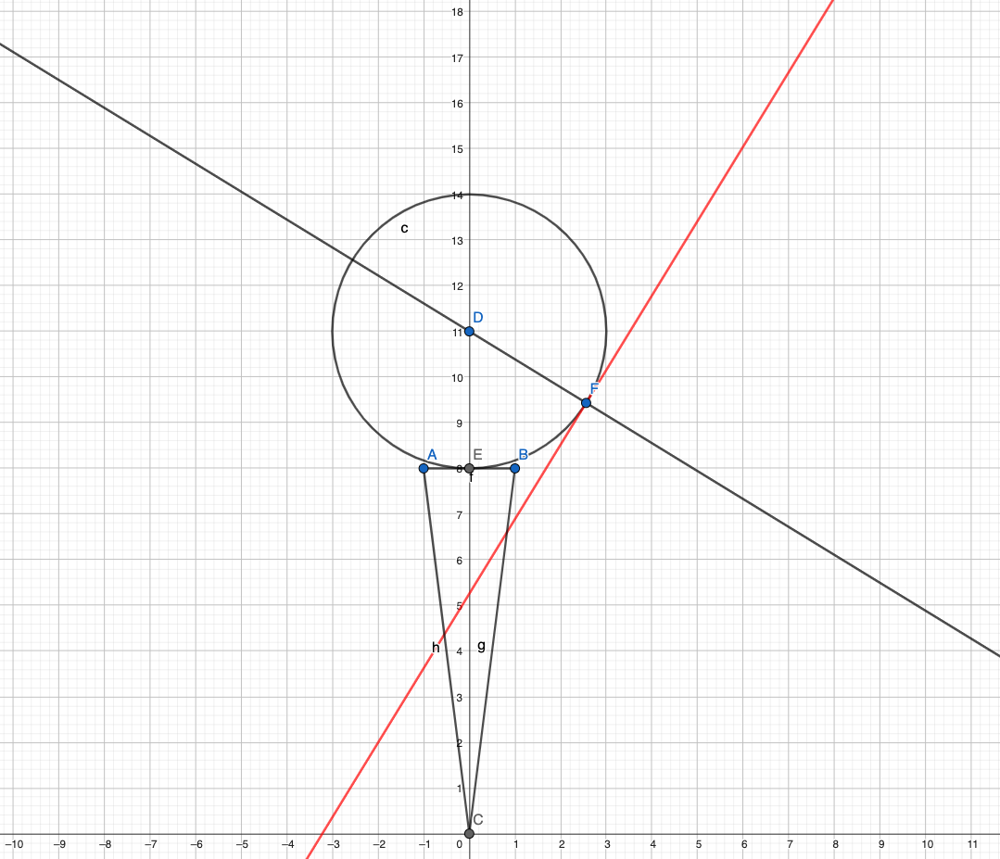

# Physik-GolfSim
### Ein Schulprojekt Physik-Klasse11 zum Thema Kraft und Impuls

#### Inhalt
> - Fragestellung und Hypothese
> - Versuchs- bzw. Simulationsaufbau sowie Annahmen über Umweltfaktoren
> - Mathematischer Aufbau der Simulation
> - Ergenisse mathematisch beschreiben
> - Die idealen Parameter für den Golfball-Abschlag
> - Schlusswort

## Fragestellung und Hypothese
Die Leitfrage dieser Arbeit ist, herauszufinden, wie Impuls und Kräfte wirken beim Abschlagen eines Golfballes, sowie mit welchem Winkel dieser am weitesten pro angewandte Kraft fliegt. Dazu konzentriere ich mich in der Simulation auf die Flugbahn des Golfballs mit verschiedenen Parametern. Die Hypothese ist, dass es zum sogenannten Stoß kommt und der Impuls des Golfschlägers auf den Ball übertragen wird. Darauf hin wirken verschiedene Kräfte sowie Impulse gegeneinander, die es zu berechnen und simulieren gilt.
Ich vermute, dass die größte Geschwindigkeit die weiteste Flugbahn ergibt, sowie der Winkel von 45° unter auslassen des Luftwiederstandes die größte Flugbahn ergibt.

## Versuchs- bzw. Simulationsaufbau sowie Annahmen über Umweltfaktoren

Für den Aufbau platzieren wir einen Golfball der Größe 3 cm (m = 50 Gramm) auf einem Tee von 8 Zentimetern Höhe. Der Schläger wird als eine Strecke der Länge 100 Zentimeter dargestellt (m = 500 Gramm).

Um den Golfball abzuschlagen, bewegen wir den Schläger auf ihn zu in einer (hier vereinfachten) geradlinigen gleichförmigen Bewegung. Wir nehmen an, dass auf den Schläger zum Zeitpunkt direkt vor dem Abschlag keine Kräfte wirken, daher der Impuls des Schlägers zu diesem Zeitpunkt konstant.

Der Stoß in dieser Simulation ist elastisch, daher wird keine Energie in Verformung oder ähnliches umgewandelt. In der Realität ist das nicht der Fall, jedoch sind diese Nebenfaktoren für die Fragestellung nicht relevant.

## Mathematischer Aufbau der Simulation
Da Nebenfaktoren auslassen werden und der Impulserhaltungssatz gilt, bleibt die Summe der Impulse bei der Übertragung an den Golfball gleich.
$$ \vec{p}_{Schläger(vor)} = \vec{p}_{Golfball(nach)} + \vec{p}_{Schläger(nach)} $$

Um die Geschwindigkeit des Golfballs nach dem Stoß zu berechnen, können  wir den Impuls des Schlägers vor und nach dem Abschlag berechnen.

Ich nutze eine Formel aus einem [Dokument](https://www.thphys.uni-heidelberg.de/~huefner/PhysikUeberall/V08S.pdf) der Uni Heidelberg, die die einfache Berechnung der Geschwindigkeit des Golfballs nach dem Stoß, aus der Geschwindigkeit des Schlägers vor dem Stoß und dem Quotienten aus der Masse des Golfballs und der Masse des Schlägers, ermöglicht.

$$ v = 2· v_{s}/(1+m/M). $$

Um die Richtung des Golfballs nach dem Stoß zu bestimmen, ziehe ich eine Gerade zwischen Mittelpunkt des Schlägers und Schnittpunkt mit dem Schläger, der vereinfach als eine Gerade dargestellt ist.
Diese Gerade steht im 90° Winkel zur Tangente am Kreis des Golfballs am Schnittpunkt mit dem Schläger.

### Simulation der Flugbahn
Nachdem ich die Anfangsgeschwindigkeit des Golfballs berechnet habe, simulieren ich die Flugkurve des Golfballs.
Dazu teile ich die Bewegung in zwei Richtungen auf, vertikal und horizontal.
$$ v_{x} = v · cos(\alpha) $$
$$ v_{y} = v · sin(\alpha) $$
Die horizontale Bewegung ist dabei in sich gleichförmig, wird aber vom Luftwiderstand ausgebremst. Die Kraft des Luftwiderstands wirkt gegen den Impuls des Golfballs.

$$ F_{Luftwiderstand} = - \frac{1}{2} · A · \rho · v^2 · c_{w} $$
$$ A = \pi · r^2 $$
$$ \rho = 1,225 kg/m^3 $$
$$ c_{w} = 0,1 $$

Die vertikale Bewegung ist ebenfalls gleichförmig, jedoch wird sie durch die Gewichtskraft gebremst.
$$ F_{Gewichtskraft} = m · g = m · 9,81m/s^2$$

### Zusammenfassung der Berechnungen
- Nach dem Stoß ist die Richtung der Geschwindigkeit des Golfballs in einer Linie mit Schnittpunkt (Schläger) und Mittelpunkt des Golfballs.
- Die Geschwindigkeit des Golfballs nach dem Stoß wird einmalig anhand der oben genannten Formel aus der Geschwindigkeit des Schlägers berechnet.
- Simuliert wird die Flugkurve des Golfballs mithilfe der oben genannten Formeln anhand der gegeneinander wirkenden Kräfte und Impulse.

## Ergebnisse an Hand von Daten beschreiben

Anhand einer einfachen Simulation konnte ich bestätigen, dass die Formel 
$$ s_{Wurfweite} = (v^2 / g) · sin(2·\alpha) $$
stimmt. 

In meiner Simulation habe ich in einer Schleife solange t erhöht (die Zeit laufen lassen), bis der Golfball den Boden berührt. 

    winkel = 45
    speed = 100 # geschwindigkeit in m/s  

    y = src.winkel.vy(speed, winkel)
    vx = src.winkel.vx(speed, winkel)

    i = 1
    while (i * vy - 0.5 * 9.81 * i**2) > 0:
        i += 0.01
    
    print(i)
    print(vx * i)

dabei kam heraus, dass der Golfball nach 14,42 Sekunden den Boden bei der Marke 1019,64 Meter berührt.
Die folgende Funktion (siehe oben, hier in Python umgewandelt) kommt auf das gleiche Ergebnis

    print((speed * speed) / 9.81 * math.sin(math.radians(2 * winkel))) # 1019.367991845056

Ausgelassen ist hier der Luftwiederstand, jedoch sind Formeln vorbereitet und die Funktion wird vorraussichtlich später noch implementiert.

## Die idealen Parameter für den Golfball-Abschlag
Mit dem folgenden Code konnte ich die Idealen Parameter herausfinden. Diese liegen bei einem Winkel von 45° und einer Geschhwindigkeit von 60 m/s.

    import src.winkel
    import src.gwkraefte
    import numpy as np
    import math

    weite = np.zeros((90, 20))

    for winkel in range(0, 90, 1):
        for speed in range(40, 60, 1):
            vy = src.winkel.vy(speed, winkel)
            vx = src.winkel.vx(speed, winkel)

            i = 1
            while (i * vy - 0.5 * 9.81 * i**2) > 0:
                i += 0.01
            
            l = vx * i

            weite[winkel, speed-40] = l

    print(np.unravel_index(np.argmax(weite), weite.shape))
    print(weite[np.unravel_index(np.argmax(weite), weite.shape)])

## Schlusswort
Der Geschwindigkeitswert ist nicht überraschend, da hier die größte Kraft wirkt. Allerdings konnte ich mit meiner Simulation nachweisen, dass der ideale Winkel bei 45° liegt.

Meine Hypothese bezüglich der Parameter wurde bestätigt. Die Simulation zeigt, dass der ideale Winkel bei 45° liegt und die Geschwindigkeit bei 60 m/s (Maximalwert).